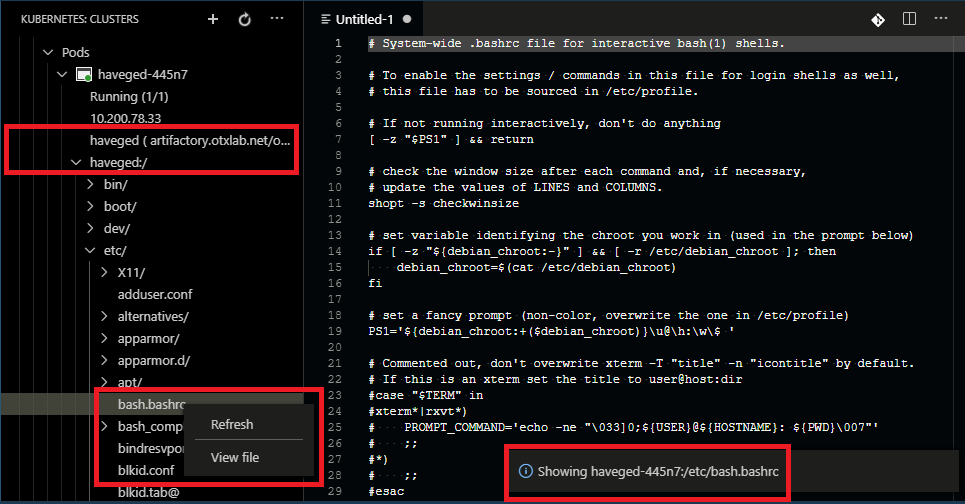

# kubernetes-file-system-explorer README

## Features

It supports the following commands:

| Command | Treenode Type| Description |
|---------|----------|-------------|
|`k8s.node.terminal` (Terminal)| Node |Start a shell into Node using nsenter. User must set the `kubernetes-file-system-explorer.nsenter-image` preference value to point to a `nsenter` image of choice e.g. `jpetazzo/nsenter:latest`.|
|`k8s.pod.container.terminal` (Terminal)| Container |Starts a shell in the Container. It basically runs: `kubectl exec -it pod-name -c containername -- sh`|
|`k8s.pod.container.folder.find` (Find)| Container Folder Node |Show the output of `find folderpath` in editor. It basically runs: `kubectl exec -it pod-name -c containername -- find /path/to/folder`|
|`k8s.pod.container.folder.ls-al` (ls -al)| Container Folder Node |Show the output of `ls -al folderpath` in editor. It basically runs: `kubectl exec -it pod-name -c containername -- ls -al /path/to/folder`|
|`k8s.pod.container.file.view` (View file)| Container File Node |Show the content of the file in editor. It basically runs: `kubectl exec -it pod-name -c containername -- cat /path/to/file`|

This extension adds tree nodes for the Kubernetes Init Containers, Containers and filesystem of the Kubernetes Containers under the Pod node in the Kubernetes Explorer View. Simply expands the treenode for a Pod to see it's Init Containers, Containers and Container filesystem. For example, the following screenshot shows the:

- the `haveged-445n7` pod
- the `haveged` container
- the `haveged` container's file system
- `View file` command in the context menu of `/etc/bash.bashrc` file
- `/etc/bash.bashrc` file content loaded in a editor tab

### How it works

It basically starts at `/` by running the following Kubectl command in the Pod to get the file listing:

`kubectl exec -it pod-name -c containername -- ls -f /`

As the tree nodes for directories are expanded e.g. `/etc/`, it basically runs:

`kubectl exec -it pod-name -c containername -- ls -f /etc/`

to get listing of files and created tree nodes for them.

## Requirements

This extension works with Microsoft Kubernetes extension.

## Known Issues

- None

## Release Notes

### 1.0.0

Initial release.

### 1.0.1

Add screenshot and description.

### 1.0.2

Add command `k8s.pod.container.file.view` (View file) - Show the content of the file in editor.

### 1.0.3

Show container.

### 1.0.4

Show filesystem of all container.

### 1.0.5

Deal with links.

### 1.0.6

Updated screenshot.

### 1.0.7

Added `Find` command for folders.

### 1.0.8

Show correct commands on Container Folder and File nodes.

### 1.0.9

Terminal command on Container node.

### 1.0.10

Use TextDocumentContentProvider.

### 1.0.11

`ls -al` command on folder nodes.

### 1.0.12

Internal.

### 1.0.13

Terminal on Kubernetes nodes using nsenter.

### 1.0.14

Detect hostName from label.

### 1.0.15

User needs to specify the nsenter image using preference `kubernetes-file-system-explorer.nsenter-image`.

### 1.0.16

Update README.

### 1.0.17

Update README.